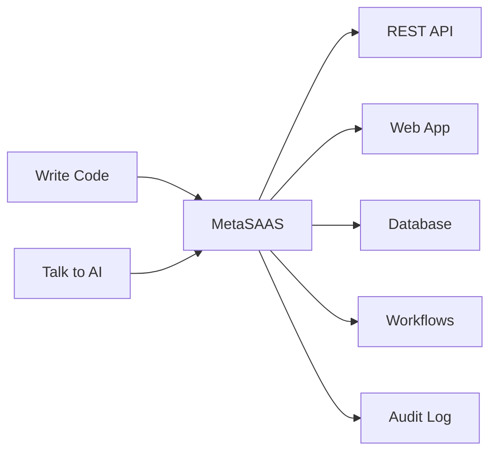
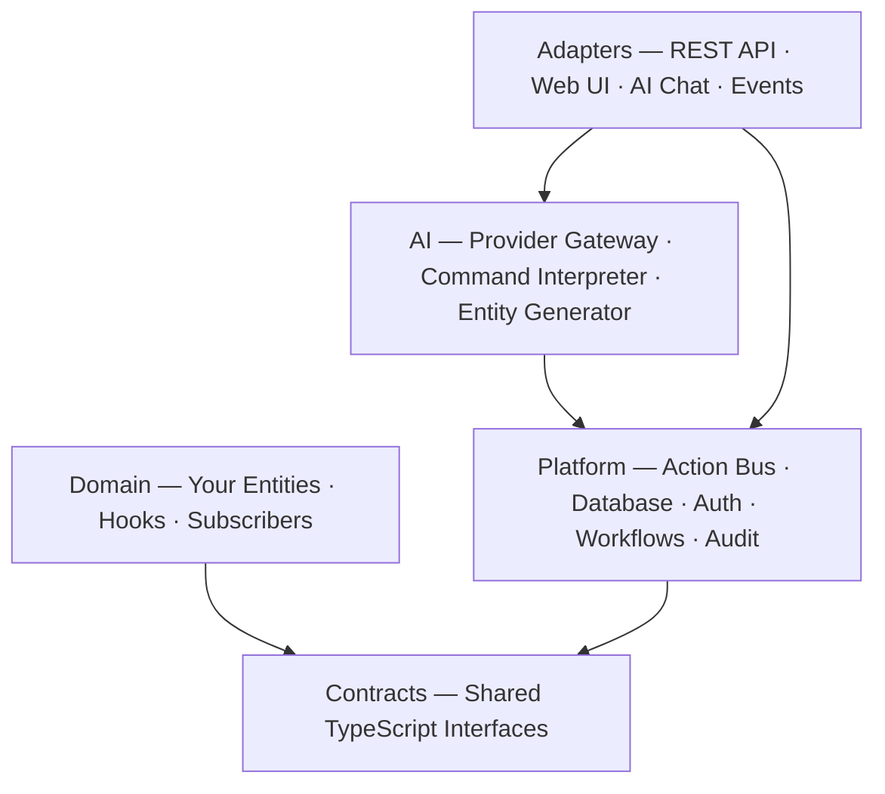

# MetaSAAS

Build full-stack SaaS applications by describing what you need — in code or plain English.

Define your business objects once. MetaSAAS gives you the API, database, web interface, workflows, and AI assistant — automatically.



> **You describe _what_ your app needs. MetaSAAS handles _how_ it works.**

## Two Ways to Build

You can write entity definitions in TypeScript, or describe what you want in the AI chat sidebar. Both produce the exact same result.

### Write code

```typescript
export const TaskEntity = defineEntity({
  name: "Task",
  fields: [
    { name: "title", type: "text", required: true },
    { name: "status", type: "enum", options: ["todo", "in_progress", "done"] },
    { name: "priority", type: "enum", options: ["low", "medium", "high"] },
  ],
  workflows: [{ name: "lifecycle", field: "status", transitions: [
    { from: "todo", to: "in_progress" },
    { from: "in_progress", to: "done" },
  ]}],
});
```

Run `pnpm db:migrate`, restart — you have a full Task management system with API, UI, workflows, and AI integration.

### Or talk to the AI

Open the chat sidebar (Cmd+K) and say what you need:

```
You: "I want to build a gym management system"

MetaSAAS generates:
  → Member, Trainer, Class, Enrollment entities
  → TypeScript files written to disk
  → Seed data, navigation, and BLUEPRINT docs included
  → Ready to use after restart
```

The generated code is standard TypeScript. You can review it, edit it, and version-control it exactly like code you wrote by hand.

You can also evolve existing entities from chat: *"Add a dueDate field to Task"* or *"Change Task status options to include blocked."* The AI reads the existing entity file, applies the change, and writes it back.

### What you get from each entity

No matter which path you take, every entity comes with:

- **REST API** — `GET`, `POST`, `PATCH`, `DELETE` + valid transitions endpoint
- **Web UI** — list view, detail page, create/edit forms, kanban board (drag-and-drop), calendar
- **Search and filtering** — text search across fields, enum dropdown filters
- **Bulk operations** — select multiple records, bulk status change, bulk delete
- **Import / Export** — CSV export from any list, CSV import with field mapping
- **Related records** — detail pages show linked records from other entities
- **Database table** — auto-created, auto-migrated when fields change
- **Workflow engine** — state machine rules enforced on every update, smart status controls
- **AI commands** — "create a high-priority task called Fix login bug"
- **AI entity evolution** — "Add a dueDate field to Task" modifies entity definitions from chat
- **Audit log** — every action recorded with who, what, when, and how long
- **Webhooks** — register URLs to receive HTTP POST on any domain event
- **Multi-tenancy** — each tenant's data is isolated at the database level

## Quick Start

### Prerequisites

- Node.js 20+
- pnpm 9+
- Docker (for PostgreSQL)

### Setup

```bash
# Clone and install
git clone https://github.com/kamalkalwa/MetaSAAS.git && cd MetaSAAS
pnpm install

# Configure environment
cp .env.example .env

# Start PostgreSQL
docker compose up -d

# Build all packages
pnpm build

# Create database tables + load demo data
pnpm db:migrate && pnpm db:seed

# Start development servers (API on :4000, Web on :3000)
pnpm dev
```

Open http://localhost:3000 — you'll see the dashboard with 13 entities across 5 domains.

### Authentication

By default, MetaSAAS runs in **dev mode** (no authentication required). To enable Supabase auth, add to your `.env`:

```
NEXT_PUBLIC_SUPABASE_URL=https://your-project.supabase.co
NEXT_PUBLIC_SUPABASE_ANON_KEY=your-anon-key
SUPABASE_URL=https://your-project.supabase.co
SUPABASE_SERVICE_ROLE_KEY=your-service-role-key
```

### AI Chat

To enable the AI chat sidebar (Cmd+K), add an AI provider key to `.env`:

```bash
AI_PROVIDER=gemini                    # gemini | openai | anthropic (auto-detects if omitted)
GOOGLE_AI_API_KEY=your-key            # for Gemini
# OPENAI_API_KEY=sk-your-key         # for OpenAI
# ANTHROPIC_API_KEY=sk-ant-your-key  # for Anthropic
```

## Architecture

MetaSAAS is built in five layers. You only write code in one of them.



| Layer | What it does | Do you write code here? |
|-------|-------------|------------------------|
| **Adapters** | Connect the outside world (HTTP requests, browser, AI chat) to the engine | No — generated from your entities |
| **AI** | Understands natural language, generates code, talks to Gemini / OpenAI / Anthropic | No — just add an API key |
| **Platform** | The engine: validates input, checks permissions, runs queries, enforces workflows, logs everything | No — it reads your entity definitions |
| **Domain** | Your business entities, field definitions, workflows, and custom hooks | **Yes — this is the only layer you touch** |
| **Contracts** | TypeScript interfaces shared between Platform and Domain | Rarely |

**Key rule:** Domain and Platform never import each other. Both depend only on Contracts. This means the platform can add features, fix bugs, or swap providers without touching your business logic.

### Project structure

```
packages/
  contracts/   → Shared TypeScript interfaces (the boundary)
  platform/    → The engine — Action Bus, database, auth, AI, events
  domain/      → Your entities and business logic (the only code you write)
  ui/          → Shared UI components
apps/
  api/         → Fastify server that wires platform + domain together
  web/         → Next.js 15 frontend that renders everything from entity metadata
```

### How every action works

Whether someone clicks a button, calls the API, or asks the AI — the request goes through the same pipeline:

```
Request → Validate → Check Permissions → Execute → Log → Respond
```

No shortcuts. No admin bypass. The AI chat uses the same validation, the same permission checks, and the same audit logging as every other entry point.

### How much code do you actually write?

| Approach | What you define | Coverage |
|----------|----------------|----------|
| **Declarative** | Fields, relationships, UI layout | ~70% of any app |
| **Configuration** | Workflows, kanban/calendar views, events | ~25% of any app |
| **Custom code** | Hooks like `beforeCreate`, `afterUpdate` | ~5% of any app |

### Included domains

| Domain | Entities | Highlights |
|--------|----------|------------|
| **CRM** | Company, Contact | Relationships, status tracking |
| **Project Management** | Project, Task | Kanban + calendar, 4-state workflow |
| **Inventory** | Warehouse, Product | 3-state lifecycle |
| **Clinic** | Doctor, Patient, Appointment | 5-state workflow, calendar view |
| **Gym** *(AI-generated)* | Member, Trainer, Class, Enrollment | Generated from a single AI prompt |

The Gym domain was created entirely by telling the AI *"I want to build a gym management system."* It generated all 4 entities, workflows, relationships, seed data, and documentation.

## Adding a New Entity

**Through code:**

1. Create `packages/domain/src/entities/{name}/` directory
2. Read `packages/domain/src/entities/BLUEPRINT.md` for the full pattern
3. Define `{name}.entity.ts` with fields, relationships, UI config
4. Create a `BLUEPRINT.md` explaining what this entity represents
5. Register in `packages/domain/src/index.ts` (entities, navigation, seed data)
6. Run `pnpm db:migrate` — restart — entity is fully operational

**Through the AI assistant:**

1. Open the chat sidebar (Cmd+K in the web UI)
2. Describe the domain: *"I need to manage invoices with line items and payment tracking"*
3. The AI generates entity files, BLUEPRINT.md docs, seed data, and registers everything
4. Run `pnpm db:migrate` — restart — domain is fully operational
5. Review and edit the generated files as needed — it's standard TypeScript

## Commands

| Command | What it does |
|---------|-------------|
| `pnpm dev` | Start all dev servers (API + Web) |
| `pnpm build` | Build all packages |
| `pnpm test` | Run all 334 unit/integration tests |
| `pnpm test:e2e` | Run 14 Playwright E2E tests |
| `pnpm db:migrate` | Create/evolve database tables from entity definitions |
| `pnpm db:seed` | Load demo data for all 13 entities |

## Testing

- **334 unit/integration tests** across 18 test files (Vitest)
  - Action Bus pipeline, RBAC, multi-tenant isolation, workflow validation
  - Entity contracts, field types, CRUD generation
  - AI command interpreter, API client, UI components
- **14 E2E tests** across 3 Playwright specs
  - Login flow (redirect, form, credentials, success)
  - Entity CRUD lifecycle (navigation, list, create, detail)
  - AI chat sidebar (open/close, keyboard shortcut, send/receive, new chat)

## Security

- **Helmet** — XSS, clickjacking, MIME sniffing protection
- **Rate limiting** — per-IP, configurable, public routes exempted
- **CORS lockdown** — environment-based origin restriction
- **Audit logging** — every Action Bus dispatch recorded (tenant, user, action, duration, success)
- **RBAC** — role-based access control with first-match-wins permission evaluation
- **Multi-tenancy** — database-level tenant isolation, no cross-tenant data leakage
- **JWT handling** — automatic 401 interception and redirect to login

See [SECURITY.md](SECURITY.md) for the full security architecture.

## Documentation

Every directory has a `BLUEPRINT.md` — 24 total. These serve as documentation for humans and instruction sets for AI agents. Read the relevant BLUEPRINT before making changes.

| Document | What it covers |
|----------|---------------|
| [VISION.md](VISION.md) | Full project vision, phases, milestones, architecture |
| [SECURITY.md](SECURITY.md) | Security architecture and threat model |
| [BLUEPRINT.md](BLUEPRINT.md) | Root architecture overview |
| [HLD.md](HLD.md) | High-level design |
| [LLD.md](LLD.md) | Low-level design |

## Tech Stack

- **TypeScript** everywhere (no JavaScript, no `any` escape hatches)
- **Turborepo** monorepo management
- **pnpm** package manager
- **Next.js 15** (App Router) frontend
- **Fastify** backend API
- **PostgreSQL** + **Drizzle ORM** database
- **Zod** runtime validation
- **Tailwind CSS** styling
- **Vitest** + **Playwright** testing

## Deploy to Production

```bash
# Copy and configure environment
cp .env.example .env
# Edit .env with production values (database password, API keys, CORS origin)

# Build and start all services
docker compose -f docker-compose.prod.yml up -d --build
```

This starts PostgreSQL, the API server, and the web frontend. The API runs on port 4000 and the web app on port 3000.

## License

[MIT](LICENSE)
