# MetaSAAS

An AI-native, entity-driven SaaS application framework. Define your business entities — through code **or** conversation — and get a full production-grade application automatically.

**The 80% of SaaS infrastructure you rebuild every time, solved once.**

## The Five Layers

```mermaid
flowchart TB
    subgraph L1 ["<b>ADAPTER LAYER</b> — the interfaces"]
        direction LR
        REST["REST API<br/><i>HTTP → Action Bus</i>"]
        WEBUI["Web UI<br/><i>Next.js 15 · dynamic<br/>from entity metadata</i>"]
        CHAT["AI Chat (Cmd+K)<br/><i>Natural language<br/>→ Action Bus</i>"]
        EVT["Event Subscribers<br/><i>React to domain<br/>events</i>"]
    end

    subgraph L2 ["<b>AI LAYER</b> — intelligence"]
        direction LR
        GW["AI Gateway<br/><i>Gemini · OpenAI · Anthropic</i>"]
        CMD["Command Interpreter<br/><i>Maps intent → actions</i>"]
        GEN["Entity Generator<br/><i>Prose → TypeScript<br/>+ writes to disk</i>"]
    end

    subgraph L3 ["<b>PLATFORM LAYER</b> — the engine"]
        direction LR
        BUS["Action Bus<br/><i>Validate · Authorize<br/>Execute · Audit</i>"]
        DB["Database<br/><i>Auto-migration<br/>Multi-tenant</i>"]
        AUTH["Auth / RBAC<br/><i>JWT · Permissions<br/>Supabase or Dev</i>"]
        WF["Workflows<br/><i>State machines<br/>Transition validation</i>"]
    end

    subgraph L4 ["<b>DOMAIN LAYER</b> — your business logic"]
        direction LR
        ENT["Entities<br/><i>defineEntity()</i>"]
        HOOKS["Hooks<br/><i>beforeCreate<br/>afterUpdate</i>"]
        SUBS["Subscribers<br/><i>React to events<br/>side effects</i>"]
        SEED["Seed Data<br/><i>Demo records<br/>per entity</i>"]
    end

    subgraph L5 ["<b>CONTRACTS</b> — the boundary"]
        direction LR
        TYPES["TypeScript Interfaces<br/><i>EntityDefinition · ActionDefinition<br/>Caller · Workflow · Permission</i>"]
        ZOD["Zod Schemas<br/><i>Runtime validation<br/>per field type</i>"]
    end

    L1 --> L2
    L2 --> L3
    L1 --> L3
    L3 --> L5
    L4 --> L5
    L3 ~~~ L4

    style L1 fill:#2d1b69,stroke:#8b5cf6,color:#fff
    style L2 fill:#1e3a5f,stroke:#3b82f6,color:#fff
    style L3 fill:#0f3460,stroke:#e94560,color:#fff
    style L4 fill:#1a472a,stroke:#22c55e,color:#fff
    style L5 fill:#1a1a2e,stroke:#6b7280,color:#fff
```



| Layer | What it does | You touch it? |
|-------|-------------|---------------|
| **Adapters** | Translate external interfaces (HTTP, browser, AI chat, events) into Action Bus calls | No — auto-generated from entity definitions |
| **AI** | Multi-provider gateway, natural language → action mapping, entity code generation | No — configure an API key and it works |
| **Platform** | The engine: pipeline validation, RBAC, database, workflows, audit logging | No — it reads your entity definitions and does everything |
| **Domain** | Your entities, fields, relationships, workflows, hooks, subscribers | **Yes — this is the only code you write** |
| **Contracts** | Shared TypeScript interfaces that both Platform and Domain import | Rarely — extend when adding new field types or capabilities |

The key architectural rule: **Domain and Platform never import each other.** Both import only from Contracts. The API app wires them together at runtime. This means the platform can evolve (new features, performance, providers) without touching a single line of your business logic.

## How It Works

There are two ways to build with MetaSAAS. Both produce the same result — a fully operational entity with CRUD, API, UI, workflows, and AI integration.


**Both paths converge at the same Action Bus.** A button click, a REST call, an AI command, and an event subscriber all go through the same validation, authorization, execution, and audit pipeline. No backdoors.

---

### Path A: Code

Define an entity in TypeScript. You get full IDE support, version control, and explicit control over every field, workflow, and UI option.

```typescript
export const TaskEntity = defineEntity({
  name: "Task",
  pluralName: "Tasks",
  fields: [
    { name: "title", type: "text", required: true },
    { name: "status", type: "enum", options: ["todo", "in_progress", "done"], defaultValue: "todo" },
    { name: "priority", type: "enum", options: ["low", "medium", "high"] },
  ],
  workflows: [{ name: "lifecycle", field: "status", transitions: [
    { from: "todo", to: "in_progress" },
    { from: "in_progress", to: "done" },
  ]}],
  ui: { icon: "check-square", listColumns: ["title", "status", "priority"], ... },
});
```

Register it, run `pnpm db:migrate`, restart — full CRUD, API, UI, workflows, AI integration, audit logging.

### Path B: AI Chat Sidebar

Open the AI assistant (Cmd+K in the web UI) and describe what you need in plain English:

```
You: "I want to build a gym management system"

AI generates:
  → Member (7 fields, status workflow, kanban view)
  → Trainer (5 fields, specialization)
  → Class (6 fields, belongsTo Trainer, calendar view)
  → Enrollment (3 fields, belongsTo Member + Class)

Files written to disk:
  → packages/domain/src/entities/member/member.entity.ts
  → packages/domain/src/entities/member/BLUEPRINT.md
  → packages/domain/src/entities/trainer/trainer.entity.ts
  → ... (8 files total + seed data)
  → packages/domain/src/index.ts (updated with imports, navigation, seed data)
```

Restart the dev server and the entire domain is operational. The generated code is standard TypeScript — you can review, edit, and version-control it like any code you wrote by hand.

### What Each Entity Gets You

Regardless of which path you take:

- **5 CRUD actions** (create, findAll, findById, update, delete) through the Action Bus
- **REST API** (`GET /api/tasks`, `POST`, `PATCH`, `DELETE`)
- **Transitions API** (`GET /api/tasks/:id/transitions` — valid next states)
- **Database table** with auto-migration and schema evolution
- **Dynamic UI** (list view, detail page, create/edit forms, kanban board, calendar)
- **AI commands** (Cmd+K: "create a task called Fix login bug with high priority")
- **Workflow enforcement** (invalid state transitions rejected with valid alternatives)
- **Audit logging** (every action recorded to `audit_log` table)
- **Multi-tenancy** (data isolation per tenant, enforced at database level)

## Quick Start

### Prerequisites

- Node.js 20+
- pnpm 9+
- Docker (for PostgreSQL)

### Setup

```bash
# Clone and install
git clone https://github.com/kamalkalwa/MetaSAAS.git && cd MetaSAAS
pnpm install

# Configure environment
cp .env.example .env

# Start PostgreSQL
docker compose up -d

# Build all packages
pnpm build

# Create database tables + load demo data
pnpm db:migrate && pnpm db:seed

# Start development servers (API on :4000, Web on :3000)
pnpm dev
```

Open http://localhost:3000 — you'll see the dashboard with 13 entities across 5 domains.

### Authentication

By default, MetaSAAS runs in **dev mode** (no authentication required). To enable Supabase auth, add to your `.env`:

```
NEXT_PUBLIC_SUPABASE_URL=https://your-project.supabase.co
NEXT_PUBLIC_SUPABASE_ANON_KEY=your-anon-key
SUPABASE_URL=https://your-project.supabase.co
SUPABASE_SERVICE_ROLE_KEY=your-service-role-key
```

### AI Chat

To enable the AI chat sidebar (Cmd+K), add an AI provider key to `.env`:

```bash
AI_PROVIDER=gemini                    # gemini | openai | anthropic (auto-detects if omitted)
GOOGLE_AI_API_KEY=your-key            # for Gemini
# OPENAI_API_KEY=sk-your-key         # for OpenAI
# ANTHROPIC_API_KEY=sk-ant-your-key  # for Anthropic
```

## Architecture


**Domain** only imports from **Contracts**. **Platform** only imports from **Contracts**. Neither imports from the other (the `x` in the diagram). This hard boundary is what enables "define once, get everything" — the platform can evolve without touching your domain code, and your domain code is pure business logic with zero infrastructure concerns.

```
packages/
  contracts/   → Shared TypeScript interfaces (the boundary between platform and domain)
  platform/    → Infrastructure engine — Action Bus, DB, auth, AI, events
  domain/      → YOUR business entities, workflows, subscribers (the ONLY code you write)
  ui/          → Shared UI components
apps/
  api/         → Fastify backend (wires platform + domain at bootstrap)
  web/         → Next.js 15 frontend (renders entities dynamically from metadata)
```

### Action Bus

Every operation — whether triggered by a button click, REST call, AI command, or event subscriber — flows through the same pipeline:

```
Request → Validate (Zod) → Authorize (RBAC) → [Before Hook] → Execute → [After Hook] → Side Effects → Audit Log → Response
```

There is no "admin bypass" or "AI shortcut." The same Zod schema validates the input, the same RBAC rules check permissions, the same workflow engine enforces state transitions, and the same audit log records the action — regardless of who or what triggered it.

### Three Layers of Complexity

| Layer | What | How | Coverage |
|-------|------|-----|----------|
| **1. Declarative** | Fields, relationships, UI | `defineEntity({...})` | ~70% of any app |
| **2. Configuration** | Workflows, views, events | `workflows`, `ui.kanban` | ~25% of any app |
| **3. Custom Code** | Business logic hooks | `hooks.beforeCreate` | ~5% of any app |

### Domains Included

| Domain | Entities | Features |
|--------|----------|----------|
| **CRM** | Company, Contact | Relationships, status tracking |
| **Project Management** | Project, Task | 4-state workflow, kanban + calendar views |
| **Inventory** | Warehouse, Product | 3-state lifecycle, AI description generation |
| **Clinic** | Doctor, Patient, Appointment | 5-state workflow, calendar view, relationships |
| **Gym** *(AI-generated)* | Member, Trainer, Class, Enrollment | Status workflow, relationships, calendar view |

The Gym domain was generated entirely by the AI from a single prompt — proving the thesis that new business domains can be created from natural language.

## Adding a New Entity

**Through code:**

1. Create `packages/domain/src/entities/{name}/` directory
2. Read `packages/domain/src/entities/BLUEPRINT.md` for the full pattern
3. Define `{name}.entity.ts` with fields, relationships, UI config
4. Create a `BLUEPRINT.md` explaining what this entity represents
5. Register in `packages/domain/src/index.ts` (entities, navigation, seed data)
6. Run `pnpm db:migrate` — restart — entity is fully operational

**Through the AI assistant:**

1. Open the chat sidebar (Cmd+K in the web UI)
2. Describe the domain: *"I need to manage invoices with line items and payment tracking"*
3. The AI generates entity files, BLUEPRINT.md docs, seed data, and registers everything
4. Run `pnpm db:migrate` — restart — domain is fully operational
5. Review and edit the generated files as needed — it's standard TypeScript

## Commands

| Command | What it does |
|---------|-------------|
| `pnpm dev` | Start all dev servers (API + Web) |
| `pnpm build` | Build all packages |
| `pnpm test` | Run all 334 unit/integration tests |
| `pnpm test:e2e` | Run 14 Playwright E2E tests |
| `pnpm db:migrate` | Create/evolve database tables from entity definitions |
| `pnpm db:seed` | Load demo data for all 13 entities |

## Testing

- **334 unit/integration tests** across 18 test files (Vitest)
  - Action Bus pipeline, RBAC, multi-tenant isolation, workflow validation
  - Entity contracts, field types, CRUD generation
  - AI command interpreter, API client, UI components
- **14 E2E tests** across 3 Playwright specs
  - Login flow (redirect, form, credentials, success)
  - Entity CRUD lifecycle (navigation, list, create, detail)
  - AI chat sidebar (open/close, keyboard shortcut, send/receive, new chat)

## Security

- **Helmet** — XSS, clickjacking, MIME sniffing protection
- **Rate limiting** — per-IP, configurable, public routes exempted
- **CORS lockdown** — environment-based origin restriction
- **Audit logging** — every Action Bus dispatch recorded (tenant, user, action, duration, success)
- **RBAC** — role-based access control with first-match-wins permission evaluation
- **Multi-tenancy** — database-level tenant isolation, no cross-tenant data leakage
- **JWT handling** — automatic 401 interception and redirect to login

See [SECURITY.md](SECURITY.md) for the full security architecture.

## Documentation

Every directory has a `BLUEPRINT.md` — 24 total. These serve as documentation for humans and instruction sets for AI agents. Read the relevant BLUEPRINT before making changes.

| Document | What it covers |
|----------|---------------|
| [VISION.md](VISION.md) | Full project vision, phases, milestones, architecture |
| [SECURITY.md](SECURITY.md) | Security architecture and threat model |
| [BLUEPRINT.md](BLUEPRINT.md) | Root architecture overview |
| [HLD.md](HLD.md) | High-level design |
| [LLD.md](LLD.md) | Low-level design |

## Tech Stack

- **TypeScript** everywhere (no JavaScript, no `any` escape hatches)
- **Turborepo** monorepo management
- **pnpm** package manager
- **Next.js 15** (App Router) frontend
- **Fastify** backend API
- **PostgreSQL** + **Drizzle ORM** database
- **Zod** runtime validation
- **Tailwind CSS** styling
- **Vitest** + **Playwright** testing

## License

[MIT](LICENSE)
