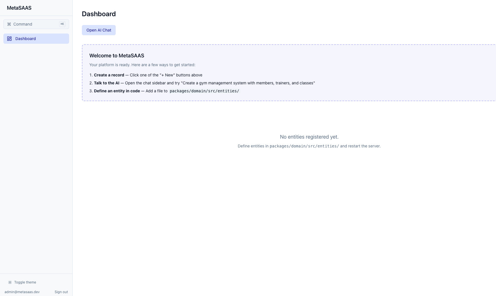
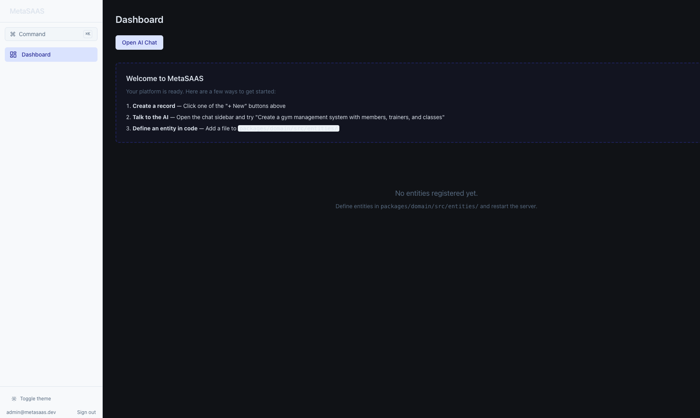

# MetaSAAS — Update Feb 24-25, 2026

## Highlights

### 1. UI Component Library — 10 New Production-Ready Components

Built a complete, reusable UI component library for the platform:

| Component | What it does |
|-----------|-------------|
| **DataTable** | Sortable columns, row selection, inline actions |
| **Pagination** | Page navigation with configurable page sizes |
| **SearchFilterBar** | Unified search input + column-specific filters |
| **BulkActionsBar** | Multi-select toolbar (delete, export selected) |
| **ConfirmDialog** | Accessible modal with danger variant for destructive actions |
| **Toast** | Auto-dismiss notifications — success, error, info |
| **EmptyState** | Illustrated zero-data placeholder with call-to-action |
| **Skeleton** | Loading placeholders for table, card, detail, and kanban layouts |
| **CopyButton** | One-click copy-to-clipboard with visual feedback |
| **ImportModal** | CSV/JSON file import with preview, validation, and error reporting |

---

### 2. Dark Mode Architecture — Fixed at the Root

**The problem:** Tailwind CSS v4's `@theme inline` directive was **hardcoding hex color values** directly into utility classes:

```css
/* What Tailwind v4 was generating */
.bg-card { background-color: #ffffff; }    /* hardcoded! */
.text-foreground { color: #0f172a; }       /* hardcoded! */
.border-border { border-color: #e2e8f0; }  /* hardcoded! */
```

Our CSS variable overrides in `:root.dark { --color-card: #1a1d27; }` were being completely ignored because no utility class referenced them. Only the manually-written `body` style used `var()`, which is why *only* the page background changed.

**The fix:** Switched from `@theme inline` to `@theme` with `var()` self-references:

```css
/* Layer 2: Tell Tailwind to generate utilities that resolve at runtime */
@theme {
  --color-card: var(--color-card);
  --color-background: var(--color-background);
  /* ... */
}

/* Layer 1: Provide actual values per theme */
:root      { --color-card: #ffffff; color-scheme: light; }
:root.dark { --color-card: #1a1d27; color-scheme: dark; }
```

Now every utility resolves CSS variables at runtime:

```css
/* What Tailwind v4 generates now */
.bg-card { background-color: var(--color-card); }         /* runtime! */
.text-foreground { color: var(--color-foreground); }       /* runtime! */
.border-border { border-color: var(--color-border); }      /* runtime! */
```

**Also added:**
- `color-scheme: dark` — tells the browser to render native form elements (selects, checkboxes, date pickers, scrollbars) in dark mode
- 12 new semantic design tokens: `popover`, `success`, `warning`, `chart-1`..`chart-6`
- Removed every `dark:` Tailwind prefix — components are 100% theme-agnostic
- Adding a new theme = one new CSS block. Zero component changes.

---

### 3. Webhook System — Production-Grade Reliability

Upgraded the webhook dispatcher with enterprise patterns:

- **Retry with exponential backoff + jitter** — failed deliveries retry automatically with increasing delays
- **Circuit breaker** (open / half-open / closed) — stops hammering failing endpoints, auto-recovers
- **HMAC SHA-256 signatures** — every payload is signed so receivers can verify authenticity
- **Async event queue** — configurable concurrency prevents webhook storms

---

### 4. Test Coverage

Added test suites for the new systems:

- Webhook retry logic and circuit breaker state transitions
- AI entity evolution (schema migration generation)
- Pagination component behavior
- UI component rendering (all 10 new components)
- Polish/integration tests for component interactions

---

## Screenshots

| Light Mode | Dark Mode |
|-----------|-----------|
|  |  |

---

## PR

- **PR #2**: [Phase 9: UI component library, dark mode architecture, webhooks & tests](https://github.com/kamalkalwa/MetaSAAS/pull/2)
- **33 files changed**, +2,615 / -432 lines
